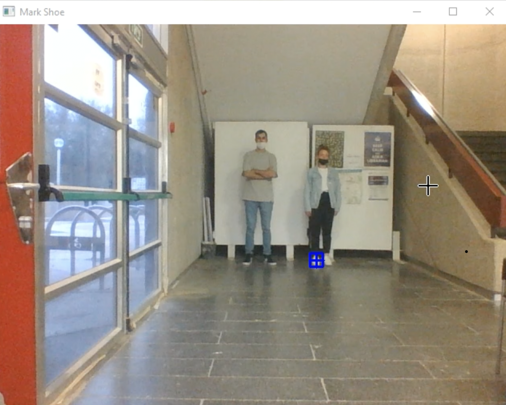
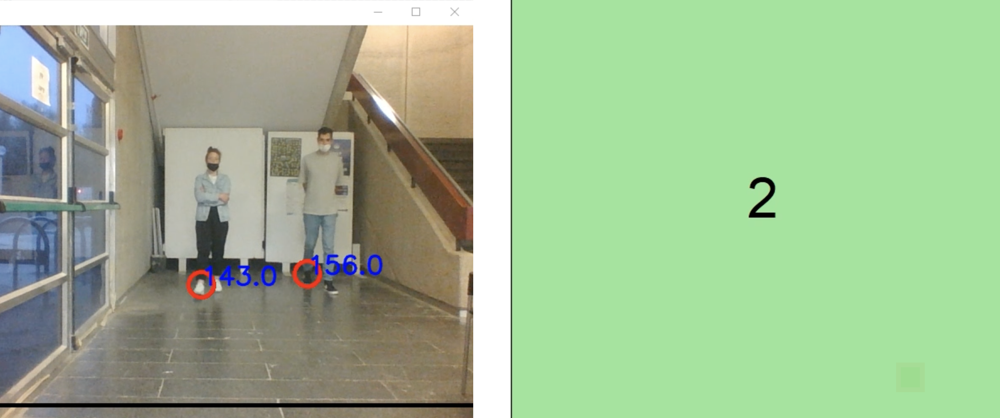
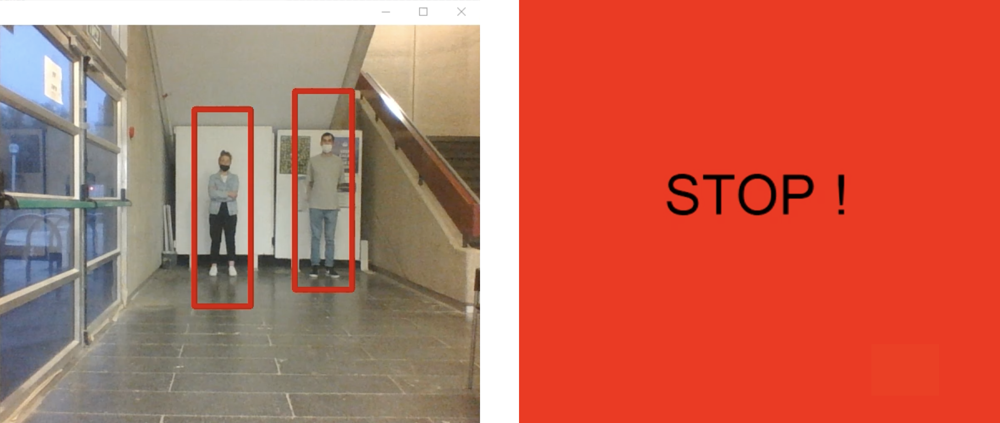
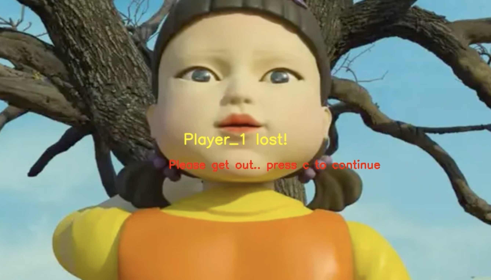
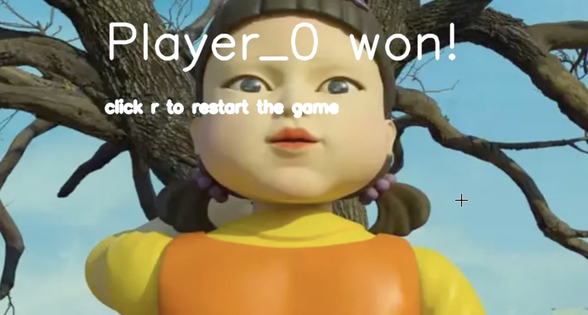

# Red Light Green Light - Image Processing Game

## Real-time play of the famous children game inspired by the Squid-Game TV-show of Netflix.

### How to play:

### 1. Go to main.py file and run it.

### 2. The Next step is to take a clear background image of game area without participants.

### 3. All participants enter the game area, and right leg needs to be mark for the detection of crossing the line. (And win!)

### 4. After all legs has beebn marked, Entering Green-Mode where players can move towards the finish line. Green Screen with countdown clock can be seen on the screen alongside the distance of the shoe from the finish line.

### 5. Entering Red-Mode. All players must stand still and do not move! Red bounding box surround each player. Red Screen is visible to the players on the screen.

### 6. If one of the players move, Entering Loser-Mode: on the screen there is a massage to the player that ones has to leave the game. (And a gun-shot sound)

### During the time that the disqualified player leave, all other players need to stand still and not move! if one of them moving, another massage on the screen will appear demanding the player also to go out.

### 7. The player who cross the finish line - Win!

---------------------------------------------------------------------------------------------------------------------------------------------------------------------------------------------------------------------------------------------------------------------------------------------------------------------------------------------------------------------------------------------------------------------------------------------------------------------------------

1. First Task to detect players is done by Image subtraction and morphological transformations.

2. For movement detection, both for Red-Mode and Green-Mode (on legs), Optical Flow is used, where density is chosen according to the enviroment playing.

3. Line detection is used by Hough Transform.

4. Another schemes for playfulness is used, as overlapping Bounding Boxes, movement detection by Jaccard condition in Loser Mode etc..
